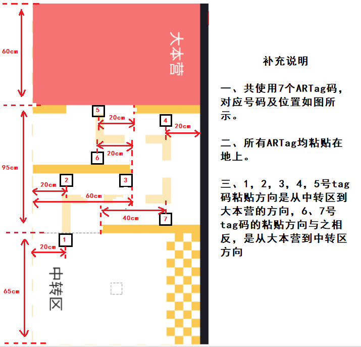
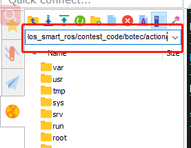
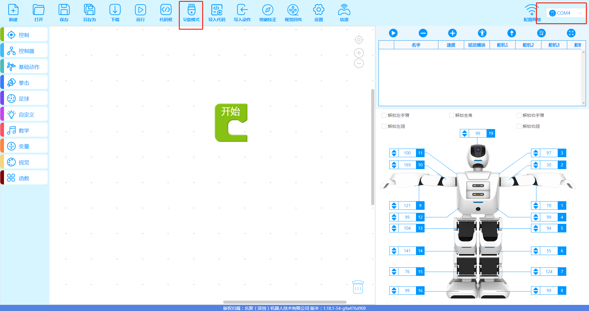
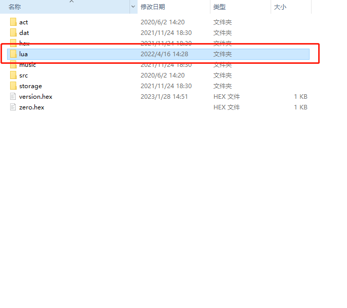
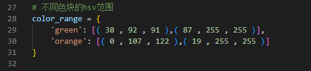

# botec比赛程序运行步骤  

### Tag粘贴图示：  
  

## 一、程序下载：
镜像下载地址：
```
www.leju.com  
```

## 二、动作工程下载  

使用Mobaxterm进行ssh连接后，在下图位置输入此路径回车,可以看到Actionlib.lua,并右击下载到电脑上    
  
```
/home/lemon/catkin_ws/src/aelos_smart_ros/contest_code/botec/action/  
```
通过 aelos_edu 连接串口，进入U盘模式，进入U盘模式下的lua 文件夹，并用刚刚下载的 Actionlib.lua 文件替换掉原来的 Actionlib.lua （这一步是将需要用的动作放到机器人中），替换完后需复位机器人  
  
  


## <font color='red'> 注意：关闭overlay操作 </font>  
当前系统处于 overlay 下(即重启机器人后不会保存修改)，修改代码需先关闭 overlay 后再进行操作，具体操作如下：
```
cd /home/lemon/catkin_ws/tools
sudo ./disable_overlay_after_reboot.sh
```
执行后会重启机器人，等待重启完毕后输入如下指令，将代码移动至 /mnt/leju_data 下，并创建软链接，方便后续修改代码，不用每次都进行overlay 的开关操作：  
```
cd /home/lemon/catkin_ws/src/aelos_smart_ros/contest_code
mv botec/ /mnt/leju_data/
ln -s /mnt/leju_data/botec/ ./
```
重启 overlay ：
```
cd /home/lemon/catkin_ws/tools
sudo ./enable_overlay_after_reboot.sh
```
等待机器人重启完毕后，即可正常修改代码  


## 三、HSV颜色采集  
HSV采集工具在  
```
/home/lemon/catkin_ws/src/aelos_smart_ros/contest_code/botec/HSV色彩选择工具/
```
根据里面的 HSV颜色工具 文档进行python的安装及采集  

### <font color='red'> **注意：当环境发生变化时，请重新采集 HSV 数值** </font>

## 四、程序调试  
botec程序位于  
```
/home/lemon/catkin_ws/src/aelos_smart_ros/contest_code/botec/botec_code.py
```

我们需要将采集到的 HSV 数值替换到，botec_code.py 中第 29，30行  
  

程序运行指令：  
```
cd /home/lemon/catkin_ws/src/aelos_smart_ros/contest_code/botec
python botec_code.py  
```