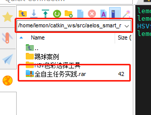
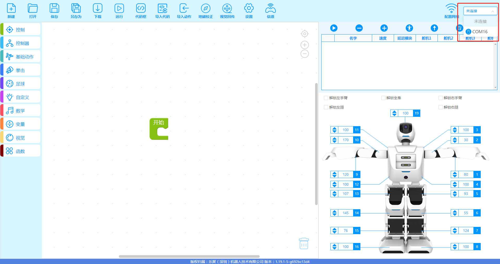

# ARtag导航案例操作手册

## 工程下载  

- 进入到此路径下载工程文件：/home/lemon/catkin_ws/src/aelos_smart_ros/contest_code/全自主任务实践/  
  
 - 右键"全自主任务实践"压缩文件，将其下载到电脑中并解压"  

 - 打开桌面软件"aelos_edu"  

 - 点击左上角的"打开"选项，找到刚刚解压的"全自主任务实践"，选择"全自主任务实践.abe"后，点击"打开"  
   
   

 - 用串口线连接机器人和上位机，点击"未连接"，选择连接的端口  
   

 - 连接上串口后，点击下载，勾选动作函数并确认  
   

## 代码运行  
- 执行以下指令：
```
cd /home/lemon/catkin_ws/src/aelos_smart_ros/contest_code/全自主任务实践/ARtag导航案例/  
python artag.py  
```

## 代码说明  
位姿信息订阅：  

遍历筛选 tag 信息：  
    
对正 tag 逻辑：  
  
主程序执行逻辑：  
  