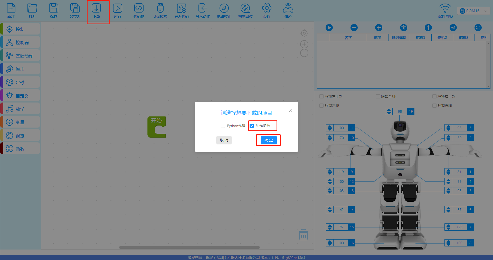

# 踢球案例操作手册

## 工程下载  

- 进入到此路径下载工程文件：/home/lemon/catkin_ws/src/aelos_smart_ros/contest_code/全自主任务实践/  
  
 - 右键"全自主任务实践"压缩文件，将其下载到电脑中并解压"  

 - 打开桌面软件"aelos_edu"  

 - 点击左上角的"打开"选项，找到刚刚解压的"全自主任务实践"，选择"全自主任务实践.abe"后，点击"打开"  
   
   

 - 用串口线连接机器人和上位机，点击"未连接"，选择连接的端口  
   

 - 连接上串口后，点击下载，勾选动作函数并确认  
   
   
## 颜色采集工具
 - 使用 `/home/lemon/catkin_ws/src/aelos_smart_ros/contest_code/全自主任务实践/` 中，HSV色彩选择工具 (具体操作说明见文件夹中 HSV颜色工具.md 文档) 对红球以及球洞进行颜色采集，并替换到代码中  
   


## 代码运行  
- 执行以下指令：
```
cd /home/lemon/catkin_ws/src/aelos_smart_ros/contest_code/全自主任务实践/踢球案例/scripts  
python kickBallOnly.py  
```

## 代码说明  
图像处理：  
  

  

踢球对正逻辑：  
  

  