# 运行说明文档  


## **一、程序下载**
镜像下载地址：   
- [比赛镜像地址](https://aelosstatic.lejurobot.com/aelos_pro_img/aelos_smart_2023_03_22_18_56_18.img.zip)  
- [镜像md5结果](https://aelosstatic.lejurobot.com/aelos_pro_img/aelos_smart_2023_03_22_18_56_18.img.zip.md5)

## **二、动作工程下载**  
首先进入到：`/home/lemon/catkin_ws/src/aelos_smart_ros/contest_code/职教组/` 中，将 职教组.rar 下载到自己的电脑中，并解压  
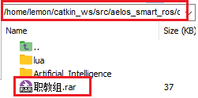  
   
通过 Aelos_edu 打开高职组文件夹中的 高职组.abe，然后连接上机器人点击下载并勾选动作函数  
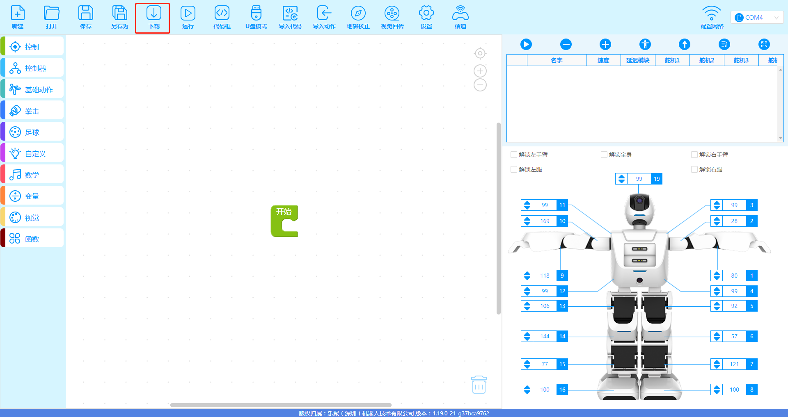  
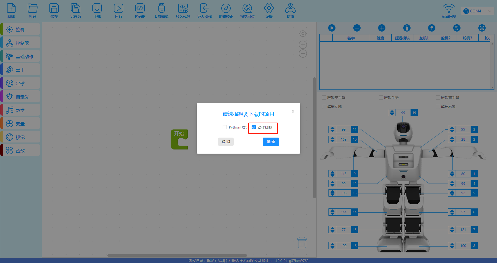  


注意：这里需要让机器人与遥控器的信道保持一致，如果不一致需设置一下信道  
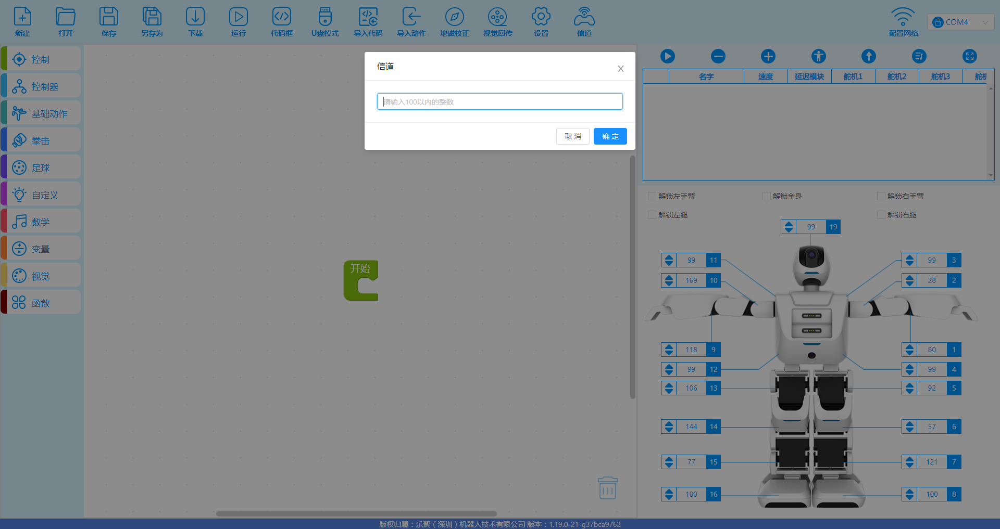  


接着开启终端

终端输入： **cd /home/lemon/catkin_ws/src/aelos_smart_ros/contest_code/职教组/Artificial_Intelligence**  
回车后输入：**python CMDcontrol.py**  
即可运行程序  
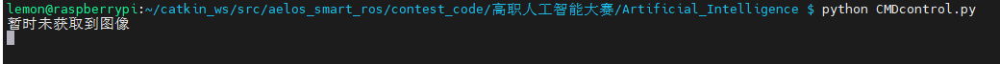  
**注意：此处在刚运行程序时，可能会打印暂时未获取到图像，这只是因为刚运行程序时，节点可能还未准备就绪，导致第一次未获取到图像，如后续并未再打印此提示，则说明可以正常获取到图像**


接下来就可以使用按键去进行操作，需将手柄设置为表演模式  
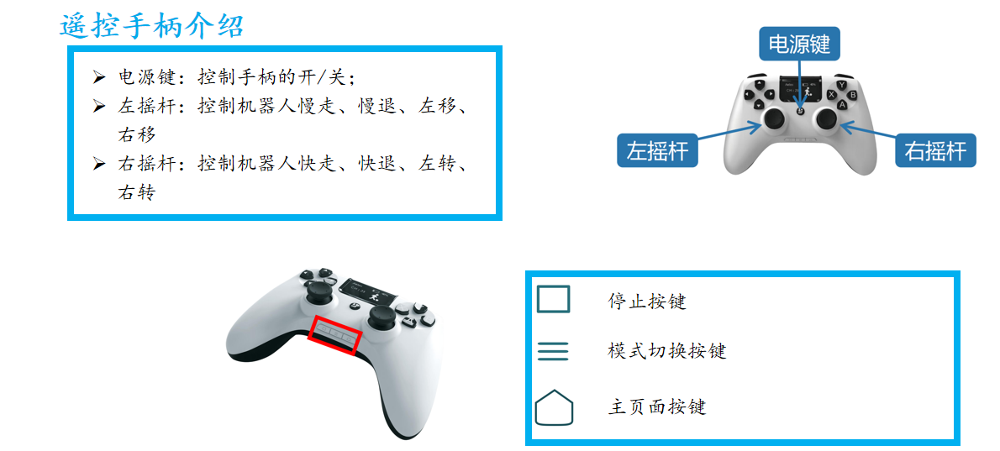  

按下模式切换按键，将模式调整为表演模式，如下图的这个图标，即为表演模式  
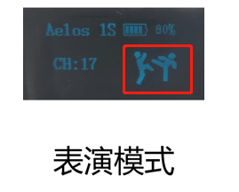  

下面即为任务绑定按键  
- X：任务一的组合任务  
- Y：拆除易燃物任务  
- A：人脸识别任务  
- B：搬运物资任务    
- RB：翻越障碍任务  

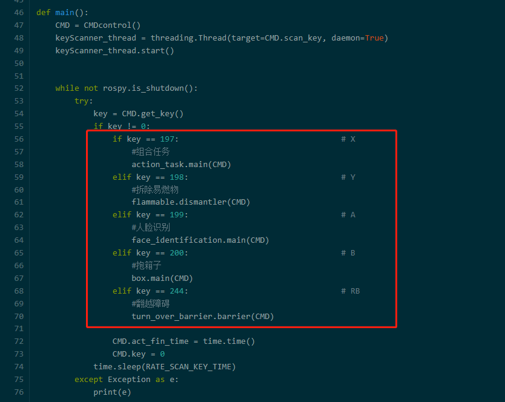  
当按下X按键时传过来的key值为197，所以当key值等于197时，说明按下了X按键，执行组合任务代码，其他按键同理    
  

## 注意：如需修改代码，需关闭overlay  
当前系统处于 overlay 下(即重启机器人后不会保存修改)，修改代码需先关闭 overlay 后再进行操作，具体操作如下：
```
cd /home/lemon/catkin_ws/tools
sudo ./disable_overlay_after_reboot.sh
```
执行后会重启机器人，等待重启完毕后输入如下指令，将代码移动至 /mnt/leju_data 下，并创建软链接，方便后续修改代码，不用每次都进行overlay 的开关操作：  
```
cd /home/lemon/catkin_ws/src/aelos_smart_ros/contest_code
mv 职教组/ /mnt/leju_data/
ln -s /mnt/leju_data/职教组/ ./
```
重启 overlay ：
```
cd /home/lemon/catkin_ws/tools
sudo ./enable_overlay_after_reboot.sh
```
等待机器人重启完毕后，即可正常修改代码  


## 提前安装 tensorflow lite 环境

如果系统中没有安装 tensorflow lite 推理环境，每次重启机器人都会执行安装。如果不想每次重启后安装可以提前安装到系统中 需要关闭 overlay

当前系统处于 overlay 下(即重启机器人后不会保存修改)，修改代码需先关闭 overlay 后再进行操作，具体操作如下：
```
cd /home/lemon/catkin_ws/tools
sudo ./disable_overlay_after_reboot.sh
```
执行后会重启机器人，运行安装脚本，将tflite推理环境安装到python环境中：
```
cd /home/lemon/catkin_ws/src/aelos_smart_ros/contest_code/职教组/Artificial_Intelligence/age_gender
sudo chmod 777 setup.sh
./setup.sh
```

成功安装会出现 `successfully installed`

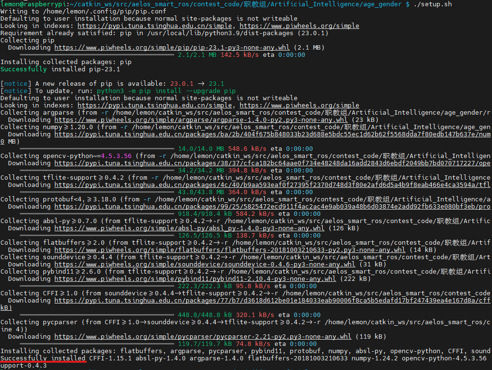

如果出现空间不足而导致安装失败，可以输入，清除日志后再次进行安装
```
sudo journalctl --vacuum-size=100M
```

重启 overlay ：
```
cd /home/lemon/catkin_ws/tools
sudo ./enable_overlay_after_reboot.sh
```


## **三、HSV颜色采集**  
HSV采集工具在  
```
/home/lemon/catkin_ws/src/aelos_smart_ros/contest_code/职教组/Artificial_Intelligence/HSV色彩选择工具/
```  
根据里面的 HSV颜色工具 文档进行python的安装及采集  


## **四、人脸识别案例**  
需要导入cv2对图像进行操作  
rospy是python的ros客户端  
sensor_msgs.msg是用于我们一直去订阅获取摄像头图像  
cv_bridge是作为ros图像和opencv图像之间的转换  
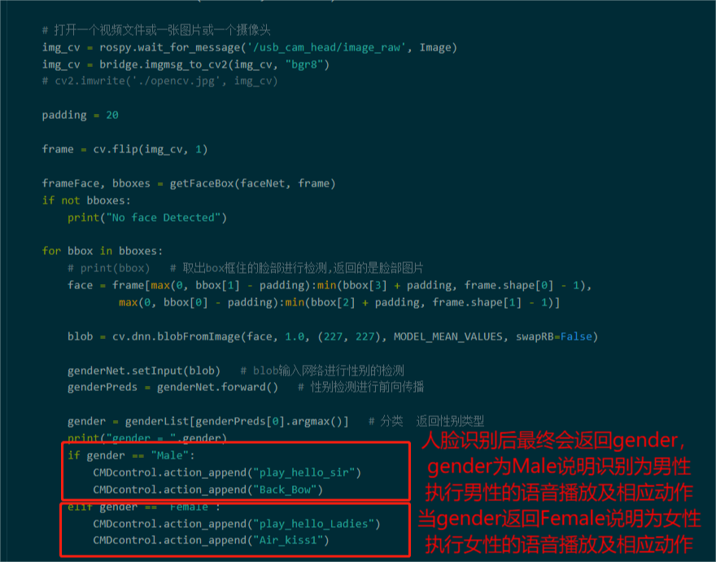  
从摄像头获取一帧下来去进行操作，最后返回人脸性别出来，再根据性别去做相应的语音和动作  
人脸识别的案例已与遥控器的A键绑定，按下按键A可实现人脸识别案例  

## **五、拆除易燃物运行说明**  
易燃物拆除主要是根据摄像头获取的图像，对易燃物的颜色进行识别，获取最小的外接矩形框，并通过矩形框的宽度，以及中心点 X 的数值去进行调整，拆除  
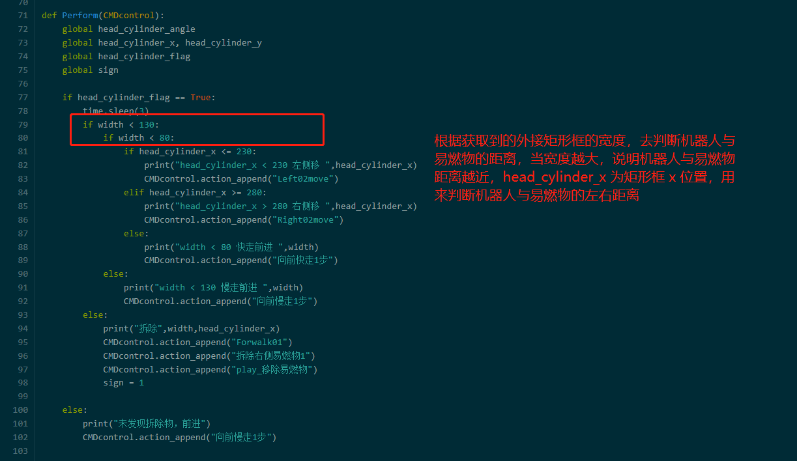  

如果拆除易燃物识别不准确需重新调整HSV数值，并替换到下图位置  
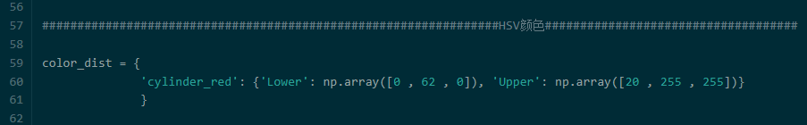  


## **六、搬运物资运行说明**  
如果识别海绵块与目标区不准确时需调整HSV数值，并替换到下图位置  
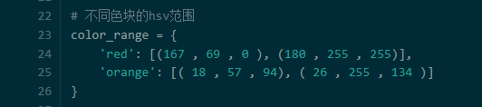  
red为资源块的HSV数值  
orange为目标地的HSV数值  

搬运物资是通过对方块以及目标区的颜色识别，获取到x和y的值，再根据x和y的值调整位置进行搬运  
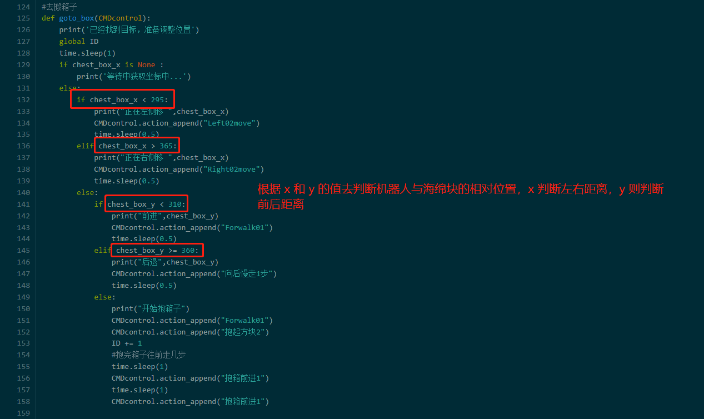  
